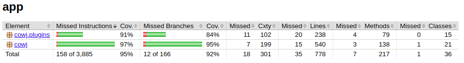
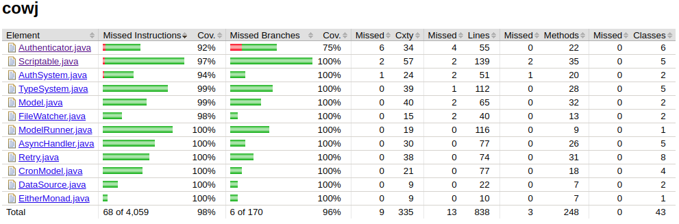
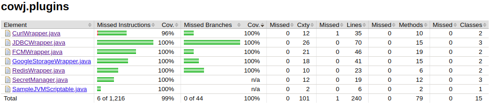

# cowj
[C]onfiguration [O]nly [Web] on [J]VM 


[toc]

## Goal

COWJ is pronounced as Cows, and stands for:

>Configuration-Only-Web-over-JVM

It should be very clear from the naming that:

>objective is to optimise back-end development and replacing it with configurations.


## Back End Development 

### Development Today 

It is pretty apparent that a lot of back-end "development" goes under:

1. Trivial CRUD over data sources
2. Reading from data sources and object massaging - via object mapper, thus mapping input to output
3. Aggregation of multiple back-end services
4. Adding random business logic to various section of the API workflows 

COWJ aims to solve all these 4 problems, such that what was accomplished by 100 of developers can be done by less than 10, a ratio of 90% above in being effective.


### How To Do it?

#### Deprecation : Service Framework

Lately, 10+ people gets allocated to maintain "how to create a service" end point.
This must stop. The following must be made true:

1. Creating a service end point should be just adding configuration 
2. Writing the service should be just typing in scriptable code 
3. Input / Output parameters are to be assumed typeless JSON at worst 

#### "Business" Logic 

There should not be any "business logic" in the code. They are susceptible to change,
hence they should be hosted outside the API end points - DSL should be created to maintain.


#### Data Store Access

Any "Service" point requiring any "data store" access need to declare it, specifically 
as part of the service configuration process. Objective of the engine would be to handle the data transfer. JSON is the choice for data transfer for now.

## Unit Testing - Code Coverage

If one is willing to use this, one must wonder  - what Makes Anything 'Prod Ready' ?
Only suitable answer is the core components must be excessively well tested, 
and should have really good instruction and branch coverage.

### Cowj All Coverage 



Thus the engine core is immensely tested, and is at per with industry standard quality.

### Cowj Core Coverage



### Cowj Plugin Coverage 



Even plugins are reasonably tested, and are ready for production usage.

## Current Implementation 

### Service Configuration

Here is the config:

```yaml
# This shows how COWJ service is routed

# port of the server
port : 8000

# routes information
routes:
  get:
    /hello : _/scripts/js/hello.js
    /param/:id  : _/scripts/js/param.js

  post:
    /hello : _/scripts/js/hello.js

# route forwarding local /users points to json_place
proxies:
  get:
    /users: json_place/users
  post:
    /users: json_place/users


# filters - before and after an URI
filters:
  before:
    "*" : _/before.zm
  after:
    "*": _/after.zm

# how to load various data sources - plugin based architecture 
plugins:
  # the package 
  cowj.plugins:
    # items from each package class::field_name
    curl: CurlWrapper::CURL
    redis: RedisWrapper::REDIS

# data store connections
data-sources:
  redis :
    type : redis
    urls: [ "localhost:6379"]

  json_place:
    type: curl
    url: https://jsonplaceholder.typicode.com
    proxy: _/proxy_transform.zm # responsible for message transform
    
cron:
  cache:
    exec: _/cache.md
    boot: true
    at: "*/5 * * * *"

```
It simply defines the routes - as well the handler script for such a route.
In this way it is very similar to PHP doctrine, as well as DJango or Play.

### Scripting 

Is Polyglot.  We support JSR-223 languages - in built support is provided right now for:

1. JavaScript 
2. Python via Jython 
3. Groovy 
4. ZoomBA  

Underlying we are using the specially cloned and jetty 11 migrated spark-java fork:

https://github.com/nmondal/spark-11

Also it uses ZoomBA extensively : https://gitlab.com/non.est.sacra/zoomba  

Here is how it works:

1. Client calls server
2. Server creates a `Request, Response` pair and sends it to a handler function
3. A script is the handler function which receives the context as `req,resp` and can use it to extract whatever it wants.
4. DataSources are loaded and injected with `_ds`  variable.

Here is one such example of routes being implemented:

```js
// javascript
let x = { "id" : req.params("id") };
x;// return 
```
The context is defined as:

https://sparkjava.com/documentation#request

https://sparkjava.com/documentation#response

#### Shared Memory

Cowj supports a global, non session oriented global memory - which can be used
to double time as a poor substitute for in memory cache -
and it is a `ConcurrentHashMap` - accessible by the binding variable `_shared`.

The syntax for using this would be:

```scala
v = _shared.<key_name> // groovy, zoomba 
v = _shared[<key_name>] // groovy, zoomba, js, python  

```


See the document  "A Guide to COWJ Scripting" found here - [Scripting](manual/scripting.md)

### Filters 

These are how one can have before and after callback before and after any route pattern gets hit.  

A `before` filter gets hit before hitting the actual route, while an `after` filter gets hit after returning from the route, so one can modify the response if need be.

Classic example of `before` filter is for `auth` while `after` filter can be used to modify response type  by adding response headers.

### Cron 
In the `cron` section one can specify the "recurring" tasks 
for a project. The key becomes name of the task, 
while:

1. `exec` : script that needs to be executed
2. `boot` : to run while system startup 
3. `at` : cron expression to define the recurrence


### Data Sources 

If the idea of COWJ is to do CRUD, where it does CRUD to/from? The underlying data is provided via the data sources.

How data sources work? There is a global map for registered data sources, which gets injected in the scripts as `_ds`  :

```js
_ds.redis
```

Would access the data source which is registered in the name of `redis` .


Right now there are the following data sources supported:

##### JDBC 

JDBC data source - anything that can connect to JDDBC drivers.

```yaml
some_jdbc:
  type: jdbc # shoule have been registered before
  driver : "full-class-for-driver"
  connection: "connection-string"
  properties: # properties for connection
    x : y # all of them will be added 
```


##### CURL

External Web Service calling. This is the underlying mechanism to call Proxies to forwarding data.


```yaml
some_curl:
  type: curl # shoule have been registered before
  url : "https://jsonplaceholder.typicode.com" # the url 
  headers: # headers we want to pass through
    x : y # all of them will be added 
```


##### Google Storage

Exposes Google Storage as a data source.

```yaml
googl_storage:
  type: g_storage # shoule have been registered before
```


##### Redis 

Exposes Redis cluster  as a data source:

```yaml
 redis :
   type : redis # should register before 
   urls: [ "localhost:6379"] # bunch of urls to the cluster 
```


##### Firebase Notification Service 

Firebase  as a data source.


### Plugins

All data sources are implemented as plug and play architecture such that no code is required to change for adding plugins to the original one.

This is how one can register a plugin to the system - the following showcases all default ones:

```yaml
# how to load various data sources - plugin based architecture 
plugins:
  # the package 
  cowj.plugins:
    # items from each package class::field_name
    curl: CurlWrapper::CURL
    fcm: FCMWrapper::FCM
    g_storage: GoogleStorageWrapper::STORAGE
    jdbc: JDBCWrapper::JDBC
    redis: RedisWrapper::REDIS

```

As one can see, we have multiple keys inside the `plugins` which corresponds to multiple packages - and under each package there are `type` of `datasource` we want to register it as, and the right side is the `implementor_class::static_field_name`.

In plain language it reads:

> A static filed `CURL` of the class `cowj.plugins.CurlWrapper` implements a `DataStore.Creator` class and is being registered as `curl` type of data store creator.

#### Library Folder 

From where plugins should be loaded? If one chose not to compile their code with COWJ - as majority of the case would be - there is a special folder in the base director defaults to `lib`.  All jars in all directories, recursively will be loaded in system boot and would be put into class path,

One can naturally change the location of the lib folder by:

```yaml
lib: _/some_other_random_dir
```

How to author COWJ plugins can be found in here [Writing Custom Plugins](manual/plugins.md)


### Proxies 

Path/Packet forwarding. One simply creates a base host - in the data source section of type `curl` and then use that key as base for all forwarding.

In the Yaml example the following routing is done:

``` 
localhost:1003/users 
--> https://jsonplaceholder.typicode.com/users
```

System responds back with the same status as of the external web service as well as the response from the web service gets transferred back to the original caller.

This `transform` is coded in the `curl` type as follows:

```yaml 
data-sources:
  json_place:
    type: curl
    url: https://jsonplaceholder.typicode.com
    proxy: _/proxy_transform.zm # responsible for message transform
```

The `proxy` section has the script to transform the following to be forwarded to the destination server :

1. `request` object 
2. `headers` has a mutable map of request headers 
3. `queries` has mutable map of all query parameters 
4. `body` has the string which is `request.body()` 

Evidently at a forward proxy level, these are the parameters one can change before forwarding it to destination.

The transformation function / script is expected to return a map of the form:

```javascript
{
  headers : {
    key : value
  },
  query : {
    key : value
  },  
  body : "request body"
}
```

In case the script does not return a map - pushed values will be used to be extracted from the script context and used as a response. 

## Running 

1. Build the app.
2. Run the app.

Note: It also has `fat-jar` via `shadowJar()` task, one can have one single fat jar for the whole project.
